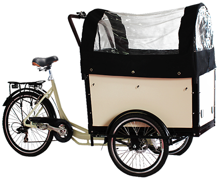
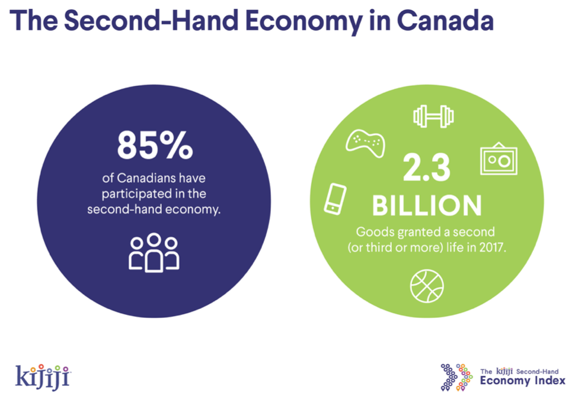
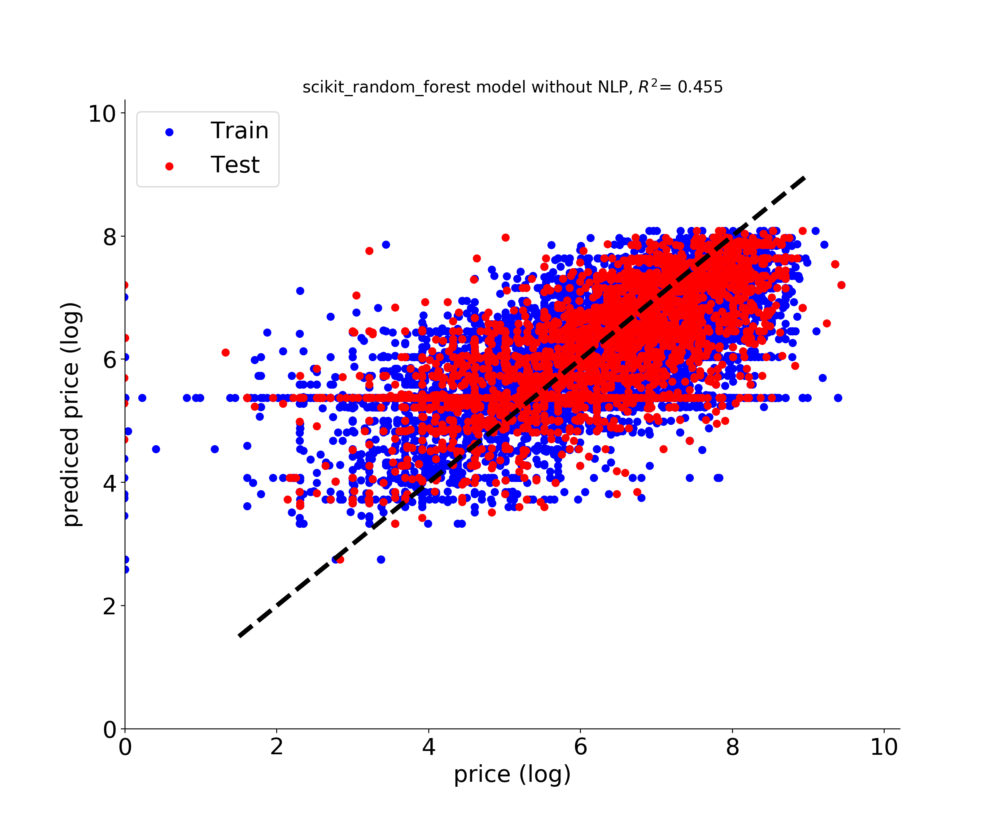
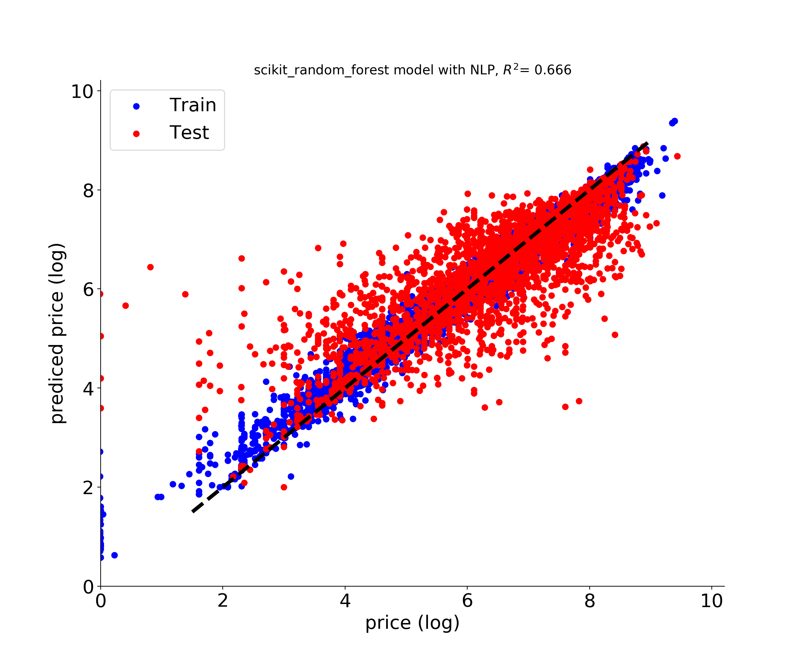
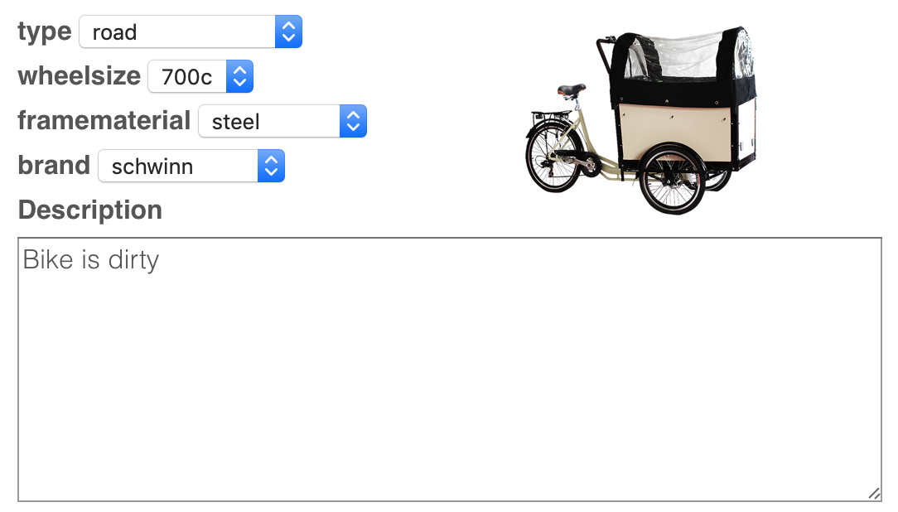

#  Price my Bike !
### Quickly pricing used items

At Insight I developed a pipeline starting with eBay's historical data of sold bicycles and ending with the deployment of a user front end based on flask running on an AWS instance. You can find my presentation [here](presentations/Bruno_Afonso_insight.pdf) or jump to the [the final web app](http://insight.brunoafonso.ca).

## Motivation

With rising concern for the environment, the used and second-hand goods industry has increased popularity in recent years. Canadian second hand economy was 28.5B in 2018 and most canadians (85%) traded used items last year. 

 

To this day, one of the main hurdle is sensibly pricing your item. This process can be very cumbersome based on each person's knowledge the item they are selling, online saviness and the availability of previous similar items online.
 
## Data acquisition and initial pre-processing

Using the eBay API I was able to gather the details of all the sold bikes during the last 90 days, roughly about 14 thousand entries. Category entries were pre-processed by removing spaces, dashes and converting to lower case. Categories containing more than 99% of missing values were discarded as well as feature entries that represented less than 1% of the total population. 

## Random Forest Regressor Model

After the previous pre processing I end up with 4 final features that I use to predict price using a random forest regressor.

## Random Forest Regressor Model with NLP-based features

Given the poor performance of the previous model I decided to expand my features using NLP. I used Latent Dirichlet Allocation (LDA) topic modeling technique to extract 6 topics based on the descriptions sellers used for each bicycle. This increased my feature set from 4 to 10 and my model became much better at predicting the price.

## Web app

In order to show the results of this modeling I deployed a web app based on Flask on an EC2 AWS instance with the help of some jQuery magic. You can find the app at [insight.brunoafonso.ca](http://insight.brunoafonso.ca)

